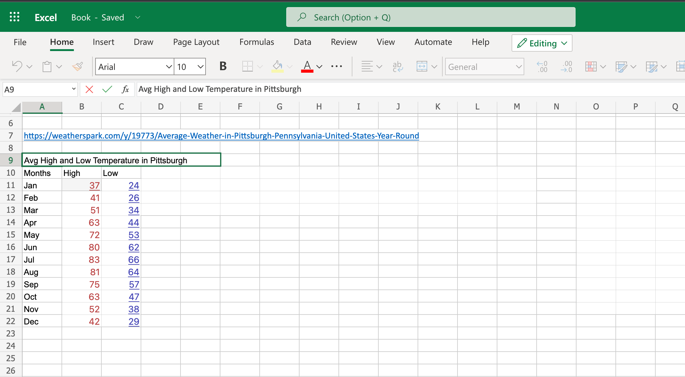
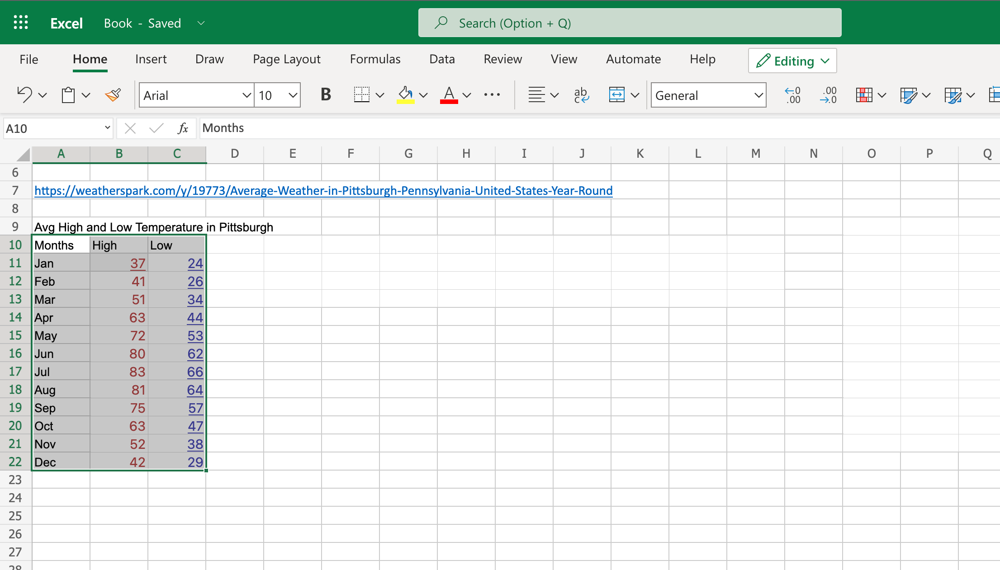
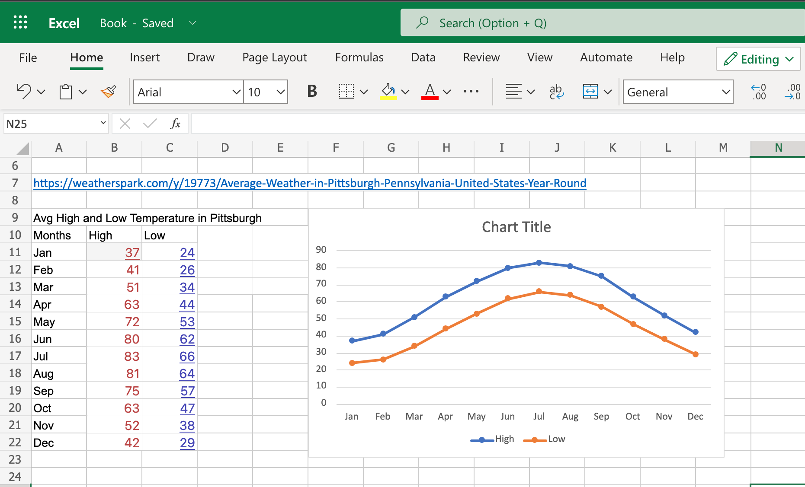
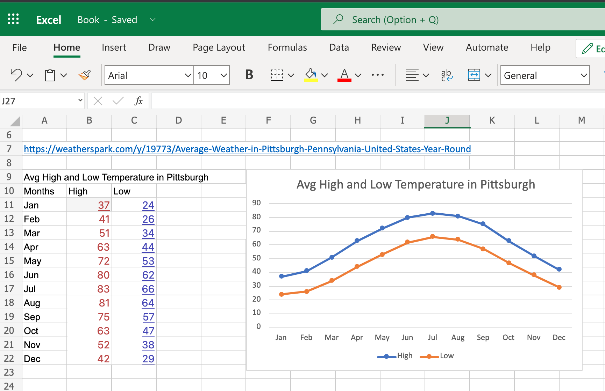
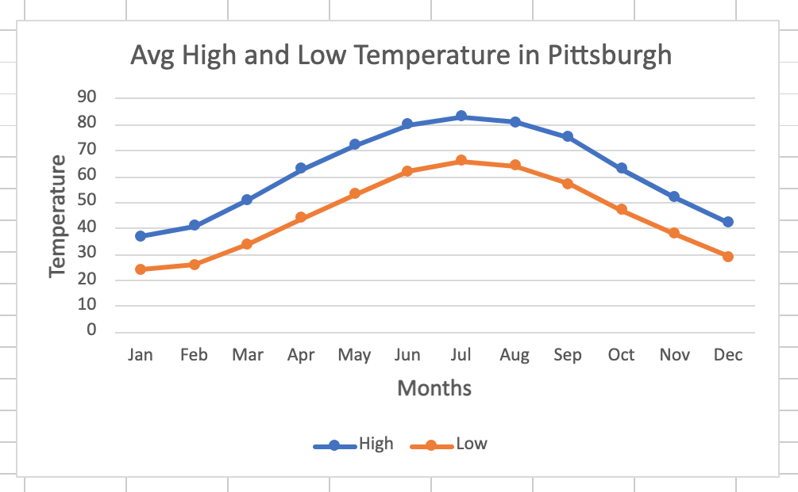

# Creating a Line Graph using Excel

When collecting, sharing and analyzing data in an Excel chart, it is helpful to represent it in a manner that is quick and easy to understand. Line graphs are the most efficient when tracking changes over short and long periods of time. They are useful in comparing data from multiple groups and allows us to make predictions about future data.  

## Required Materials
- Computer
- Excel
- Data gathered for graph

## Steps
1. Open up an excel spreadsheet and save it in a safe location.

2. Create a table on excel with the data gathered for your graph. 

3. Highlight the data in your table that you want to represent in your line graph. To select columns that are not next to each other, select one column, then hit control and drag over the other column.

4. Click on "Insert" in the top toolbar.

5. Go to "Line" and select the line graph that works best for the data.

6. Make sure to click the graph that best represents your data. In this case, we will click on the line graph.

6. Move the graph to where you would like it positioned on the spreadsheet.

7. Change the tittle of the graph by clicking on "Chart Tittle" at the top of the graph.

8. Next, change the x and y axes by clicking on them as well.

9. You now have a graph! Make sure your data is clear and visible by changing the height, width, thickness etc. as needed.

